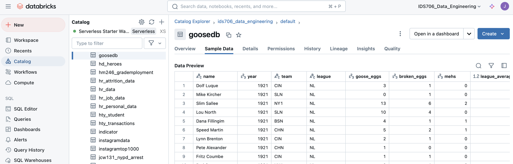
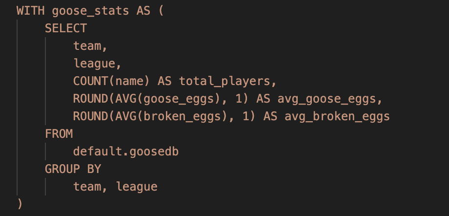
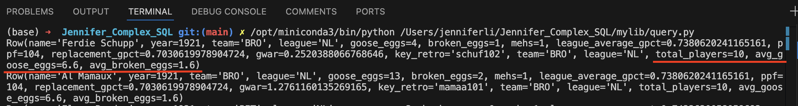
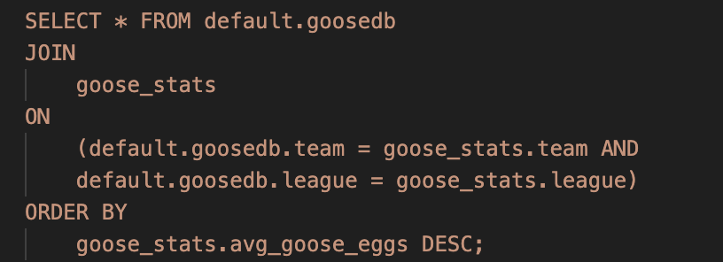
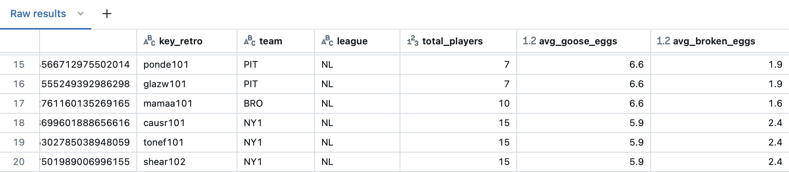
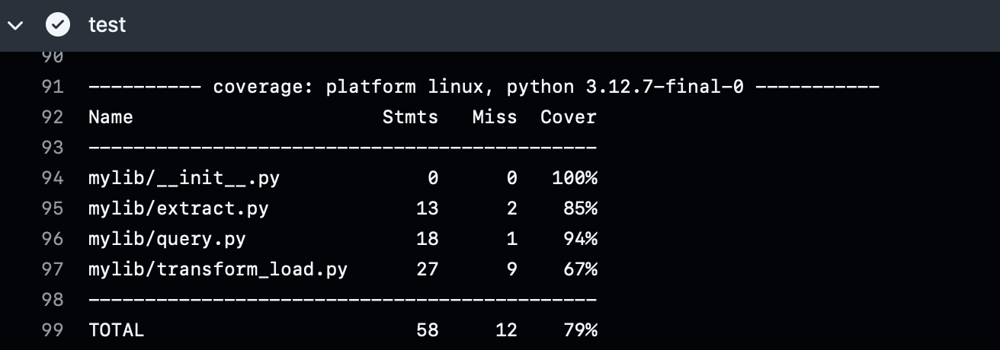

# Mini Project 6: Complex SQL Query Project for MySQL Database - Baseball Player Performance Analysis

## Project Purpose
This project involves extracting, transforming, and loading (ETL) baseball statistics data into an external database Databricks, and then performing complex SQL queries on the data.

## Project Data Source
The data used in this project comes FiveThirtyEight's public dataset: https://raw.githubusercontent.com/fivethirtyeight/data/refs/heads/master/goose/goose_rawdata.csv 

## Project Highlights
1. Utilizes Databricks SQL for big data processing and analytics
2. Implements Common Table Expressions (CTE) for efficient data manipulation
3. Employs complex SQL Query with joins, aggregations and sorting techniques
4. Uses Lint and code format to maintain code quality, and uses tests for key functionalities
5. Applies secure environment variables including "DATABRICKS_KEY", "SERVER_HOSTNAME", "HTTP_PATH" for Databricks authentication.

## Data Connection

* `File mylib/extract.py`: Fetches baseball statistics from a URL and saves it locally as Goose.csv
* `File "mylib/transform_load.py`: Transforms and loads data into Databricks database using the "databricks-sql-connector". 

*Successful Data Connection 😃*

## Complex SQL Query

* File "mylib/query.py": Executes a complex SQL query on the loaded data

### 1. Create a Common Table Expression (CTE) named goose_stats

### SQL Explanation

**SELECT Statement**

The query selects the following columns:

- **team**: The name of the team.
- **league**: The league to which the team belongs.
- **COUNT(name) AS total_players**: This counts the total number of players associated with each team and assigns it an alias `total_players`.
- **ROUND(AVG(goose_eggs), 1) AS avg_goose_eggs**: This calculates the average number of goose eggs for each team, rounding it to one decimal place, and assigns it the alias `avg_goose_eggs`.
- **ROUND(AVG(broken_eggs), 1) AS avg_broken_eggs**: This computes the average number of broken eggs for each team, also rounding it to one decimal place, with the alias `avg_broken_eggs`.

**FROM Clause**

The data is sourced from the `default.goosedb` table, which contains the relevant information for the query.

**GROUP BY Clause**

The results are grouped by `team` and `league`. This means that the aggregation functions (like `COUNT` and `AVG`) will operate within each combination of team and league, providing statistics specific to each group.

#### Expected Results from the `goose_stats` CTE

The `goose_stats` CTE will return a summarized table containing the following information for each team and league:

- **Total Players** (`total_players`): The total number of players associated with each team.
- **Average Goose Eggs** (`avg_goose_eggs`): The average number of goose eggs scored by players on each team.
- **Average Broken Eggs** (`avg_broken_eggs`): The average number of broken eggs for each team.

#### Actual Results

*Create Goose_stats Successfully 😃*

### 2. Join and sort the data

The main query then joins this aggregated data back to the original player-level data, and then sorts the results by the team's average "goose eggs" in descending order.

### SQL Explanation

- **SELECT Statement**
The query selects all columns (`*`) from the combined results of the `default.goosedb` table and the `goose_stats` CTE.
- **FROM Clause**
The data is sourced from the `default.goosedb` table, which contains player and team information.
- **JOIN Operation**
The query performs an inner join with the `goose_stats` CTE. The join condition specifies that the `team` and `league` columns in both the `default.goosedb` table and the `goose_stats` CTE must match. This effectively combines the records based on their team and league affiliations.
- **ORDER BY Clause**
The results are ordered by `avg_goose_eggs` in descending order. This means that teams with higher average goose eggs will appear first in the result set.

#### Expected Results
The query will return a combined table that includes all columns from both the `default.goosedb` table and the `goose_stats` CTE. The expected results include:

- Detailed player information from the `default.goosedb` table.
- Corresponding average goose eggs and other metrics from the `goose_stats` CTE.
- The records will be sorted in descending order by the average number of goose eggs (`avg_goose_eggs`), allowing users to easily identify the teams with the highest performance based on this metric.

#### Actual Results

*Join and Sort Data Successfully 😃*

## Testing Passed

## References
https://github.com/nogibjj/sqlite-lab

